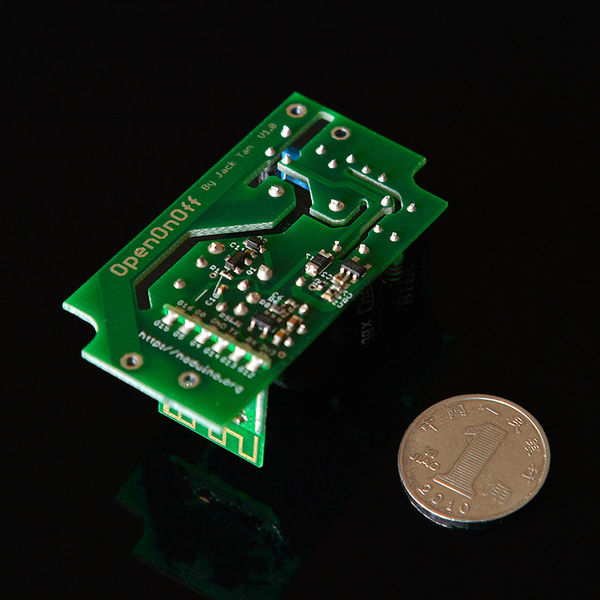
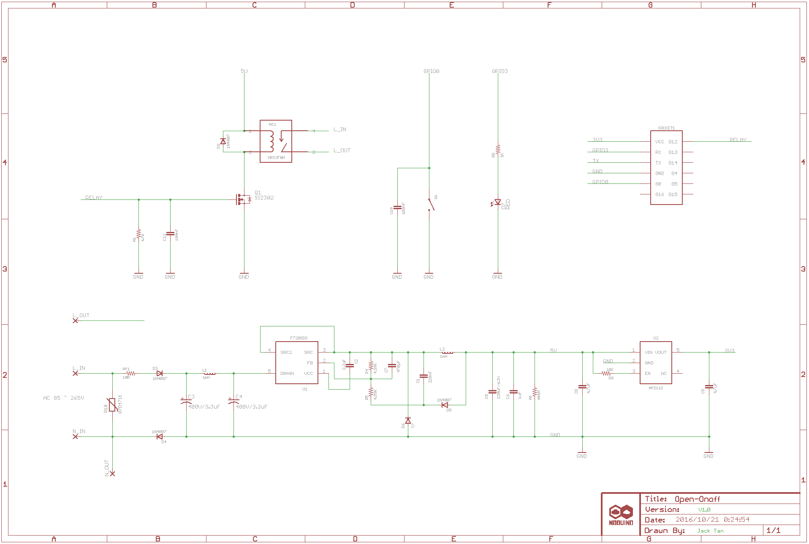
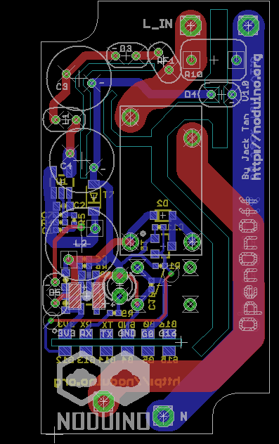

Noduino Open Onoff
=======================================

[*Noduino Open Onoff (OpenOnoff V1.0)*](http://wiki.jackslab.org/Noduino_OpenOnoff)

[*Noduino Open Onoff (OpenOnoff V1.0)*](http://wiki.jackslab.org/Noduino_OpenOnoff)

Overview
-------------------

* AC 85V - 250V WiFi Smart Switch
* ESP8285 inside
* 250V 10A relay
* Shell size 63mm x 33mm x 21mm (H)

Shell
-------------------

* https://item.taobao.com/item.htm?id=535597515580

WiFi Module
-------------------

[*Noduino NodeC WiFi Module*](http://wiki.jackslab.org/Noduino_SmartNode)

SCH
-------------------

[*Noduino Open Onoff (OpenOnoff V1.0)*](http://wiki.jackslab.org/Noduino_OpenOnoff)

Layout
-------------------

[*Noduino Open Onoff (OpenOnoff V1.0)*](http://wiki.jackslab.org/Noduino_OpenOnoff)

WiKi
-------------------

* http://wiki.jackslab.org/Noduino_OpenOnoff

License Information
-------------------
The hardware is released under [Creative Commons ShareAlike 4.0 International](https://creativecommons.org/licenses/by-sa/4.0/).

Distributed as-is; no warranty is given.
